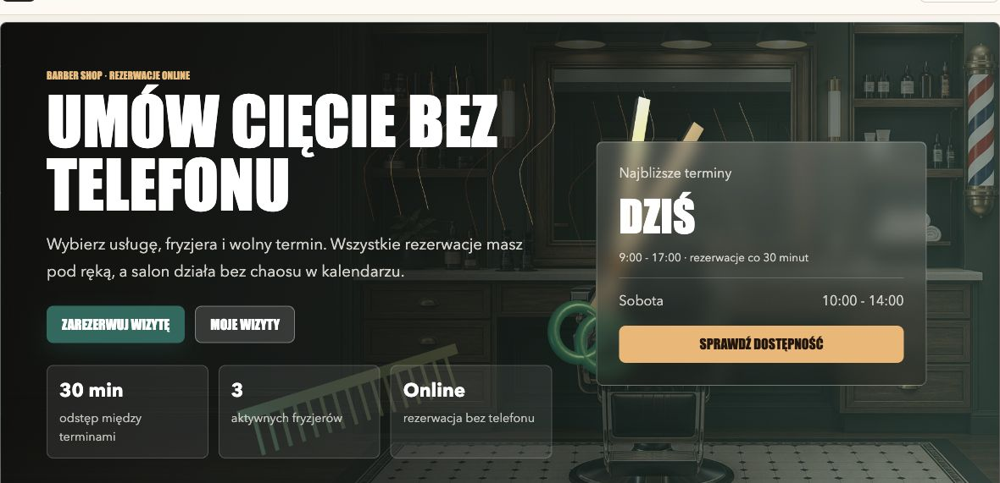
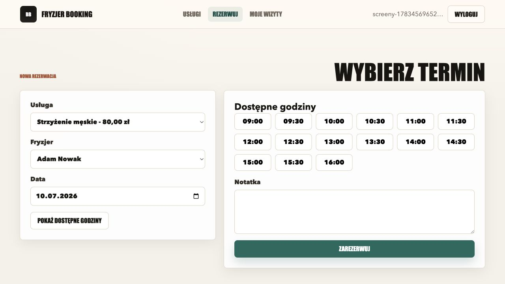
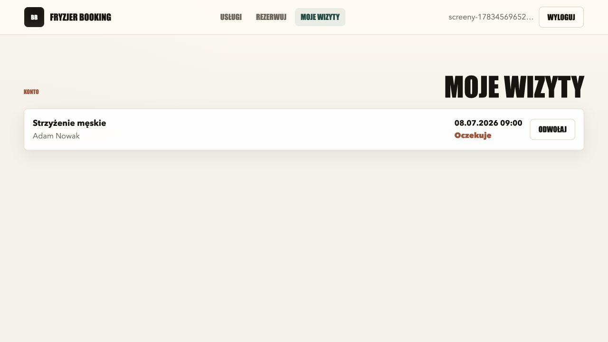

# Fryzjer Booking

System rezerwacji wizyt dla barber shopu z panelem klienta, logowaniem, dostępnością terminów i nowoczesnym interfejsem w Blazorze.


## Zrzuty Ekranu

### Strona Główna



### Rezerwacja Wizyty



### Moje Wizyty



## O Projekcie

Fryzjer Booking to aplikacja webowa do obsługi rezerwacji w salonie fryzjerskim lub barber shopie. Klient może założyć konto, wybrać usługę, fryzjera oraz wolny termin, a potem zarządzać swoimi wizytami w widoku „Moje wizyty”.

Projekt ma pełny backend w ASP.NET Core, interfejs w Blazor Server, uwierzytelnianie przez ASP.NET Core Identity, bazę SQLite oraz polskie endpointy API. Kod domenowy jest nazwany po polsku, dzięki czemu projekt jest czytelny jako aplikacja biznesowa, a nie tylko techniczne demo.

## Najważniejsze Funkcje

- Rejestracja i logowanie użytkowników.
- Bezpieczne uwierzytelnianie przez ASP.NET Core Identity.
- Lista usług fryzjerskich z ceną i czasem trwania.
- Lista aktywnych fryzjerów.
- Wybór daty oraz dostępnych godzin wizyty.
- Blokowanie kolizji terminów.
- Widok „Moje wizyty” dla zalogowanego klienta.
- Odwoływanie przyszłych rezerwacji.
- Minimal API z polskimi adresami endpointów.
- Automatyczne utworzenie lokalnej bazy SQLite przy starcie.
- Nowoczesny landing page z grafikami, animacją scrolla, sceną 3D Three.js oraz płynnym paskiem barber pole.

## UI i UX

Strona główna została przygotowana pod klimat barber shopu:

- mocna typografia w stylu szyldu salonu,
- ciemna paleta z zielenią, drewnem, złotem i kremem,
- lokalne grafiki w `wwwroot/images`,
- lokalna scena Three.js z nożyczkami, grzebieniem i animowanymi pasmami włosów,
- animowane wejścia elementów podczas scrollowania,
- subtelny parallax na wybranych sekcjach,
- płynny pasek barber pole bez widocznego zacięcia na starcie,
- responsywny układ na desktop i mobile.

Warstwa animacji znajduje się w:

```text
wwwroot/js/site.js
```

## Technologie

| Obszar | Technologia |
| --- | --- |
| Backend | ASP.NET Core |
| Frontend | Blazor Server + Three.js |
| Logowanie | ASP.NET Core Identity |
| Baza danych | SQLite |
| ORM | Entity Framework Core |
| Widoki konta | Razor Pages |
| API | Minimal API |
| Język | C# |

## Szybki Start

Wymagane jest SDK .NET 10 lub nowsze.

```bash
dotnet --version
```

Sklonuj repozytorium:

```bash
git clone git@github.com:MarcinMq/rezerwacja-wizyt-u-fryzjera.git
cd "rezerwacja-wizyt-u-fryzjera"
```

Przywróć paczki i uruchom aplikację:

```bash
dotnet restore
dotnet run
```

Możesz też wymusić konkretny adres lokalny:

```bash
dotnet run --no-launch-profile --urls http://127.0.0.1:5107
```

Po starcie otwórz:

```text
http://127.0.0.1:5107
```

Przy pierwszym uruchomieniu aplikacja utworzy lokalną bazę:

```text
barber-booking.db
```

Baza dostaje przykładowe usługi i fryzjerów z seedingu.

## Konto Testowe

Projekt nie tworzy domyślnego konta użytkownika. Konto zakłada się z poziomu aplikacji:

```text
/konto/rejestracja
```

Wymagania hasła:

- minimum 8 znaków,
- co najmniej jedna mała litera,
- co najmniej jedna cyfra.

## Endpointy API

### Konto

| Metoda | Endpoint | Opis |
| --- | --- | --- |
| `GET` | `/api/konto/ja` | Dane aktualnie zalogowanego użytkownika |
| `POST` | `/api/konto/rejestracja` | Rejestracja konta |
| `POST` | `/api/konto/logowanie` | Logowanie |
| `POST` | `/api/konto/wylogowanie` | Wylogowanie |

### Rezerwacje

| Metoda | Endpoint | Opis |
| --- | --- | --- |
| `GET` | `/api/uslugi` | Lista aktywnych usług |
| `GET` | `/api/fryzjerzy` | Lista aktywnych fryzjerów |
| `GET` | `/api/dostepnosc` | Dostępne terminy dla fryzjera, usługi i dnia |
| `GET` | `/api/wizyty/moje` | Wizyty zalogowanego użytkownika |
| `POST` | `/api/wizyty` | Utworzenie rezerwacji |
| `PATCH` | `/api/wizyty/{wizytaId}/odwolaj` | Odwołanie wizyty |

Przykład dostępności:

```bash
curl "http://127.0.0.1:5107/api/dostepnosc?fryzjerId=1&uslugaId=1&data=2026-06-30"
```

Przykład rejestracji:

```bash
curl -X POST "http://127.0.0.1:5107/api/konto/rejestracja" \
  -H "Content-Type: application/json" \
  -d '{
    "email": "jan@example.com",
    "haslo": "Test1234",
    "imieINazwisko": "Jan Kowalski",
    "telefon": "500600700"
  }'
```

Przykład rezerwacji:

```bash
curl -X POST "http://127.0.0.1:5107/api/wizyty" \
  -H "Content-Type: application/json" \
  -d '{
    "fryzjerId": 1,
    "uslugaId": 1,
    "rozpoczynaSie": "2026-06-30T10:00:00+02:00",
    "notatka": "Proszę krótkie boki"
  }'
```

## Struktura Projektu

```text
.
├── Components/              # Layout, routing i widoki Blazor
│   └── Pages/               # Strona główna, rezerwacja, moje wizyty
├── Data/                    # Kontekst EF Core i dane startowe
├── FryzjerBooking.Tests/     # Testy xUnit logiki rezerwacji
├── Models/                  # Modele domenowe
├── Pages/Account/           # Logowanie, rejestracja i wylogowanie
├── PunktyKoncowe/           # Minimal API
├── Services/                # Logika rezerwacji
├── wwwroot/css/             # Style aplikacji
├── wwwroot/images/          # Lokalne grafiki UI
├── wwwroot/js/              # Animacje i efekty scrolla
├── wwwroot/lib/three/        # Lokalna biblioteka Three.js
├── Program.cs               # Konfiguracja aplikacji
└── BarberBooking.csproj     # Projekt .NET
```

## Ważne Pliki

| Plik | Rola |
| --- | --- |
| `Program.cs` | Konfiguracja ASP.NET Core, Identity, EF Core i routingu |
| `Data/KontekstAplikacji.cs` | Mapowanie modeli do SQLite |
| `Data/DaneStartowe.cs` | Seed usług i fryzjerów |
| `Services/SerwisRezerwacji.cs` | Logika dostępności, rezerwacji i odwoływania wizyt |
| `PunktyKoncowe/PunktyKoncoweKonta.cs` | API konta |
| `PunktyKoncowe/PunktyKoncoweRezerwacji.cs` | API usług, fryzjerów i wizyt |
| `Components/Pages/Home.razor` | Strona główna |
| `Components/Pages/BookAppointment.razor` | Formularz rezerwacji |
| `Components/Pages/MyAppointments.razor` | Lista wizyt użytkownika |
| `FryzjerBooking.Tests/SerwisRezerwacjiTests.cs` | Testy kolizji i równoległych rezerwacji |
| `wwwroot/css/app.css` | Wygląd aplikacji |
| `wwwroot/js/site.js` | Animacje scrolla i parallax |

## Build

```bash
dotnet build
```

## Testy

```bash
dotnet test FryzjerBooking.Tests/FryzjerBooking.Tests.csproj
```

Znane ostrzeżenie:

```text
NU1903: SQLitePCLRaw.lib.e_sqlite3 2.1.11
```

To ostrzeżenie pochodzi z transytywnej paczki SQLite. Projekt mimo tego buduje się poprawnie.

## Status

Projekt jest gotowy jako lokalna aplikacja demonstracyjna do rezerwacji wizyt u fryzjera. Ma działające konto użytkownika, rezerwacje, widok wizyt, API oraz dopracowaną stronę główną z dynamicznym UI.

## Możliwe Rozszerzenia

- Panel administratora do potwierdzania wizyt.
- Role użytkowników: klient, fryzjer, administrator.
- Edycja godzin pracy salonu z poziomu UI.
- Powiadomienia e-mail po rezerwacji.
- Migracje EF Core zamiast `EnsureCreated`.
